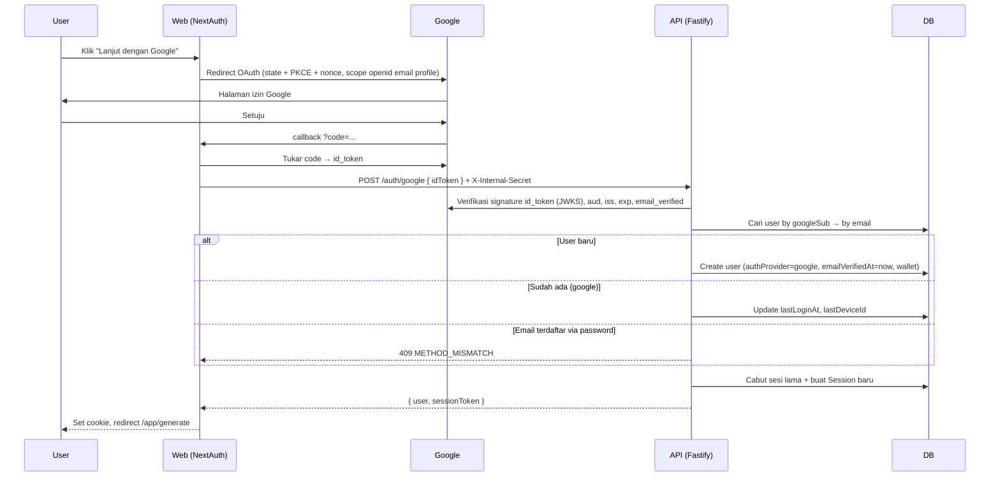
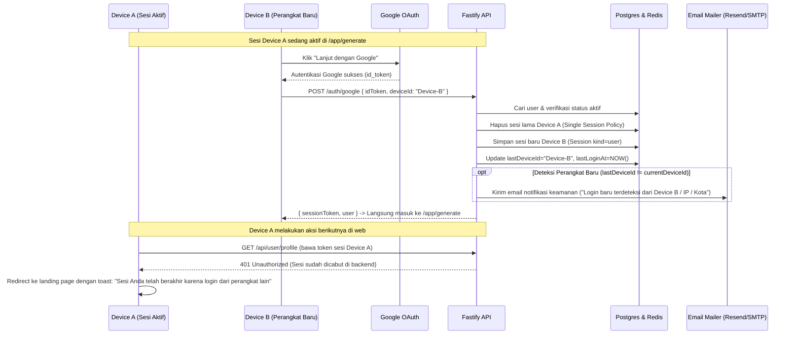
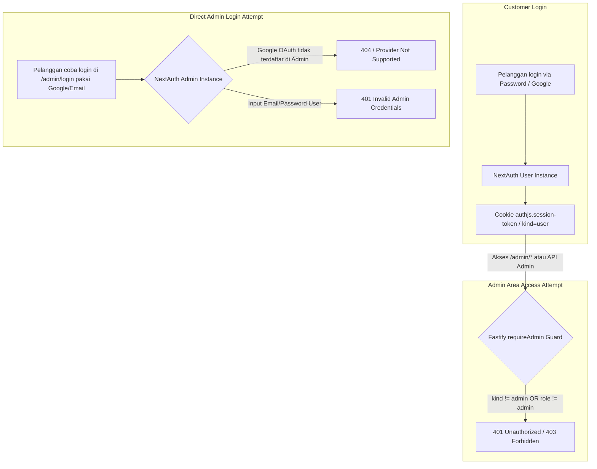
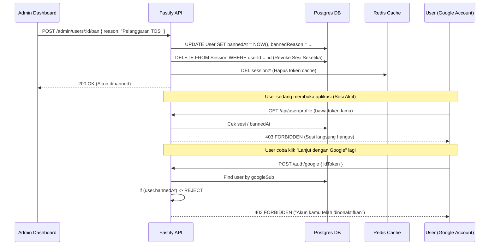

# Assessment: Login & Daftar dengan Google

**Tanggal**: 7 Oktober 2026 · **Status**: Draft, menunggu keputusan · **Estimasi**: ±3–4 hari kerja (1 dev)

---

## 1. Ringkasan

| Pertanyaan | Jawaban singkat |
|---|---|
| Bisa ditambahkan tanpa membongkar auth yang ada? | **Ya.** NextAuth v5 sudah dipakai di web; cukup tambah Google provider + 1 endpoint baru di API. |
| Login Google perlu OTP? | **Tidak.** Lihat [§4](#4-apakah-login-google-perlu-otp). |
| Akun/Token Pelanggan bisa akses Admin? | **Tidak bisa sama sekali.** Terisolasi total di level DB, cookie, session kind, dan endpoint ([§6](#6-isolasi-keamanan-pelanggan-vs-admin-rbac--token-isolation)). |
| Admin bisa Suspend/Delete akun Google? | **Bisa penuh (100%).** Google hanya IdP; otorisasi, suspend, dan delete mutlak di tangan admin ([§7](#7-kendali-penuh-admin-atas-akun-google-suspend--terminate)). |
| Perubahan DB? | Ya, 2 kolom baru di `User` (`authProvider`, `googleSub`). Migration aman (additive). |
| Risiko utama | Account pre-hijacking, user enumeration, dan replay `id_token`. Semuanya bisa dimitigasi ([§5](#5-security-best-practice)). |

---

## 2. Kondisi Saat Ini (hasil audit kode)

- **Web** ([create-auth.ts](file:///home/ubuntu/projects/ai-gen-free/apps/web/lib/create-auth.ts)): NextAuth `5.0.0-beta.32`, sesi JWT, 2 provider Credentials (`password`, `otp`). NextAuth hanya membungkus `sid` dari API; **sesi asli ada di tabel `Session` milik API**.
- **API** ([service.ts](file:///home/ubuntu/projects/ai-gen-free/apps/api/src/auth/service.ts)):
  - `registerUser` → whitelist domain (gmail/yahoo/ymail), cek kekuatan password, lalu kirim link verifikasi email.
  - `loginUser` → cek password, lalu `emailVerifiedAt`, lalu `bannedAt`. Kalau login pertama atau perangkat berganti, **wajib OTP email**. Kalau tidak, satu sesi aktif saja (sesi lama dicabut).
- **DB** (`User`): `email @unique` dan `passwordHash String?`. `passwordHash` sudah nullable, jadi akun tanpa password sudah didukung secara struktural.

---

## 3. Desain yang Direkomendasikan

### 3.1 Arsitektur — "NextAuth handle OAuth, API pemilik identitas"



**Kenapa begini:** NextAuth sudah menangani `state`, PKCE, dan cookie OAuth dengan benar. API tetap menjadi satu-satunya sumber kebenaran untuk user dan sesi, sama seperti flow password sekarang. Opsi lainnya, membangun OAuth manual di Fastify, butuh kerja lebih banyak dan permukaan bug-nya lebih besar.

### 3.2 Perubahan Skema

```prisma
enum AuthProvider {
  password
  google
}

model User {
  // ...existing
  authProvider AuthProvider @default(password)
  googleSub    String?      @unique   // ID permanen Google ("sub"), BUKAN email
}
```

> [!NOTE]
> Kalau nanti mau menambah Apple atau Facebook, lebih rapi pakai tabel `UserIdentity(provider, providerAccountId @unique, userId)`. Untuk kebutuhan sekarang (satu metode per akun), dua kolom di atas sudah cukup.

### 3.3 Matriks Aturan Bisnis

| # | Skenario | Hasil |
|---|---|---|
| 1 | Email belum ada, klik Google (dari modal Daftar **atau** Masuk) | Akun dibuat otomatis, `emailVerifiedAt = now`, wallet dibuat, langsung masuk ke `/app/*` |
| 2 | Akun Google sudah ada, klik Google lagi (dari modal Daftar) | **Langsung login** (lihat catatan di bawah) |
| 3 | Akun Google, lalu login manual email + password | ❌ `"Akun kamu sudah terdaftar, silakan masuk menggunakan metode lain"` |
| 4 | Akun Google, lalu **daftar** manual dengan email yang sama | ❌ Pesan yang sama |
| 5 | Akun Google, lalu "Lupa kata sandi" | Tidak mengirim email reset. Respons tetap generik (anti-enumeration) |
| 6 | Akun password (sudah verifikasi), lalu klik Google dengan email yang sama | ❌ Pesan yang sama *(perlu keputusan, lihat Q2)* |
| 7 | Akun password **belum verifikasi**, lalu klik Google dengan email yang sama | Akun **diambil alih oleh Google**: `passwordHash = null`, `authProvider = google`. Ini mencegah *pre-hijacking* |
| 8 | Akun di-ban, lalu klik Google | ❌ Error FORBIDDEN, sama seperti sekarang |
| 9 | Admin login | Google **tidak** diaktifkan untuk admin |

> [!IMPORTANT]
> **Soal "jika sudah pernah daftar dengan Google tidak bisa daftar lagi" (skenario 2).** Praktik terbaik industri: tombol Google = *login-or-register*. Kalau user yang sudah terdaftar menekan "Lanjut dengan Google" di modal Daftar, langsung loginkan saja. Menampilkan error di sini hanya membuat user bingung, dan tidak ada manfaat keamanannya. Yang **diblokir** adalah pendaftaran *manual* memakai email yang sudah terdaftar via Google (skenario 4). Mohon konfirmasi apakah interpretasi ini sesuai.

---

## 4. Alur Login Google & Lintas Perangkat (Multi-Device Flow)

### 4.1 Apakah Login Google Perlu OTP?
**Rekomendasi: TIDAK pakai OTP email untuk login Google.**

| Fungsi OTP saat ini | Pada login Google |
|---|---|
| Membuktikan user memiliki email | Sudah dibuktikan Google (`email_verified: true`) |
| Verifikasi perangkat baru / mencegah login dari password bocor | Tidak ada password yang bisa bocor. Google sudah menjalankan deteksi risiko, 2-Step Verification, dan passkey miliknya sendiri |
| Faktor kedua | Inbox Gmail yang menerima OTP **adalah akun Google yang sama**. Penyerang yang menguasai akun Google juga bisa membaca OTP-nya. Jadi OTP di sini **menambah gesekan tanpa menambah keamanan** |

---

### 4.2 Flow Login di Perangkat Berbeda (Cross-Device Journey)

Ketika pelanggan yang sudah terdaftar via Google melakukan login di **perangkat baru / browser lain (Device B)** sementara sesi di **perangkat lama (Device A)** masih aktif:



#### Langkah-langkah Teknis:
1. **Login di Device B**: Pelanggan menekan tombol *"Lanjut dengan Google"*. Google memverifikasi identitas (termasuk 2FA Google milik user jika aktif).
2. **Penegakan 1 Sesi Aktif (*Single Active Session*)**:
   - Backend menghapus sesi lama di tabel `Session` (`prisma.session.deleteMany({ where: { userId } })`).
   - Sesi baru untuk Device B diterbitkan dan disimpan.
3. **Notifikasi Keamanan Email (Non-blocking)**:
   - Jika `lastDeviceId` berbeda dengan perangkat sebelumnya, backend secara asinkron mengirimkan email pemberitahuan: *"Kami mendeteksi login baru ke akun Anda dari [Browser/OS] pada [Waktu]"*. Ini memberikan ketenangan bagi user tanpa menghambat akses (*zero friction*).
4. **Respon pada Device A**:
   - Begitu user di Device A melakukan navigasi atau request API berikutnya, middleware mendeteksi bahwa token sesi sudah tidak ada di DB (HTTP 401).
   - Web client membersihkan state lokal dan mengarahkan user keluar secara halus (*clean logout*).

---

## 5. Security Best Practice

### 5.1 Verifikasi token (paling kritis)
- [ ] Verifikasi `id_token` **di API**, jangan hanya percaya web. Pakai `google-auth-library` → `OAuth2Client.verifyIdToken()`.
- [ ] Cek `aud === GOOGLE_CLIENT_ID`, `iss ∈ {accounts.google.com, https://accounts.google.com}`, `exp` belum lewat, dan `email_verified === true`.
- [ ] Cek `nonce` cocok dengan yang dikirim saat authorize (mencegah replay).
- [ ] Simpan `jti` / hash token di Redis dengan TTL sesuai `exp`. Tolak kalau token yang sama dipakai dua kali.
- [ ] **Identifikasi user lewat `sub`, bukan email.** Email Google bisa berubah, `sub` tidak.

### 5.2 Endpoint `/auth/google`
- [ ] Hanya boleh dipanggil oleh web server: wajibkan header `X-Internal-Secret` (env baru) dan pastikan endpoint ini **tidak diteruskan** oleh catch-all proxy [`/api/[...path]`](file:///home/ubuntu/projects/ai-gen-free/apps/web/app/api/%5B...path%5D/route.ts).
- [ ] Rate limit per IP (reuse `enforceRateLimit`, misalnya 10x / 15 menit).
- [ ] Audit log: `auth.google.register`, `auth.google.login`, `auth.google.method_mismatch`.

### 5.3 OAuth flow
- [ ] `checks: ["pkce", "state", "nonce"]` di Google provider.
- [ ] Scope minimal `openid email profile`. **Jangan** minta `offline_access` dan **jangan simpan** access/refresh token Google (tidak dibutuhkan).
- [ ] Redirect URI exact-match di Google Cloud Console: `https://satulabs.id/api/session/callback/google` (+ localhost untuk dev).
- [ ] `callbackUrl` di-whitelist hanya `/app/*` (mencegah open redirect).
- [ ] Production: `COOKIE_SECURE=true`.

### 5.4 Enumerasi akun
Pesan *"akun kamu sudah terdaftar, silakan masuk menggunakan metode lain"* memang mengungkap bahwa email tersebut terdaftar. **Ini bisa diterima** karena endpoint register yang sekarang sudah membocorkan informasi yang sama (`EMAIL_ALREADY_REGISTERED`). Mitigasinya:
- Pesan **tidak menyebut "Google"**. "Metode lain" sudah tepat.
- Pertahankan rate limit login per IP dan per email.
- Lupa password untuk akun Google tetap merespons pesan sukses generik.

### 5.5 Konsistensi akun Google-only di Profil & Pengaturan
- [ ] `changeUserPassword` dan `requestPasswordReset` menolak/no-op kalau `authProvider = google`.
- [ ] Di halaman profil/pengaturan ([`account-settings.tsx`](file:///home/ubuntu/projects/ai-gen-free/apps/web/views/app/profile/components/account-settings.tsx)): Form ganti kata sandi disembunyikan dan digantikan dengan card/banner informasi yang jelas: **"Akun Anda terhubung dengan Google"** (dengan ikon Google dan status terverifikasi).


---

## 6. Isolasi Keamanan: Pelanggan vs Admin (RBAC & Token Isolation)

Prinsip keamanan utama: **Akun pelanggan (baik manual maupun Google) dan akun Admin terisolasi secara mutlak di semua layer.**

### 6.1 Tabel Matriks Isolasi (Customer vs Admin)

| Layer | Akun Pelanggan (Manual / Google) | Akun Admin | Mekanisme Proteksi & Isolasi |
|---|---|---|---|
| **Database `Role`** | `role = "user"` | `role = "admin"` | Kolom `role` di tabel `User`. Pendaftaran publik (manual & Google OAuth) **selalu** di-hardcode `role = "user"`. |
| **Session Cookie** | `authjs.session-token` (User) | `authjs.admin-session` (Admin) | Instance NextAuth terpisah (`createAuth("user")` vs `createAuth("admin")`) dengan cookie name dan base path terpisah (`/api/session` vs `/api/admin/session`). |
| **Session Kind di DB** | `kind = "user"` | `kind = "admin"` | Tabel `Session` menyimpan `kind`. Token pelanggan tidak valid untuk konteks admin dan sebaliknya. |
| **API Middleware Guard** | `userFromCookie(token, "user")` | `requireAdmin` (`userFromCookie(token, "admin")`) | Endpoint admin (`/admin/*`) mengecek: (1) `session.kind === "admin"` DAN (2) `session.user.role === "admin"`. Jika user biasa membawa token customer ke endpoint admin, **langsung ditolak 401/403**. |
| **OAuth Provider Path** | Terdaftar di NextAuth user (`/api/session`) | **TIDAK ADA** provider Google di NextAuth admin | Endpoint `/api/admin/session` hanya menerima credentials khusus admin. Tidak ada alur OAuth Google yang bisa menerbitkan session admin. |

### 6.2 Skenario Serangan / Uji Penetrasi & Hasilnya



1. **Pelanggan mencoba mengakses halaman/API admin dengan session aktif pelanggan**:
   - Middleware `requireAdmin` di Fastify membaca token cookie `admin-session-token` atau Authorization Bearer token dengan parameter `kind: "admin"`.
   - Token pelanggan hanya terdaftar dengan `kind: "user"`. Backend gagal memverifikasi dan mereturn `401 Unauthorized`.
2. **Pelanggan mencoba login di portal admin menggunakan email & password pelanggan**:
   - Service `loginAdmin` memverifikasi bahwa `user.role === "admin"`. Jika `role !== "admin"`, login digagalkan dengan `401 Invalid credentials` meskipun password benar.
3. **Pelanggan mencoba login di portal admin via tombol Google**:
   - Google provider **tidak didaftarkan** pada konfigurasi NextAuth admin (`createAuth("admin")`). Rute callback OAuth admin tidak ada.

---

## 7. Kendali Penuh Admin atas Akun Google (Suspend & Terminate)

> [!IMPORTANT]
> **Apakah admin bisa suspend (ban) atau terminate (delete) akun yang login dengan Google?**
> **YA, 100% BISA DAN PENUH KENDALI.**
> Google hanya berfungsi sebagai *Identity Provider (IdP)* saat proses login/otentikasi. Begitu identitas diverifikasi, seluruh siklus hidup akun, otorisasi, hak akses, saldo wallet, dan data di aplikasi Satulabs sepenuhnya berada di bawah kendali database dan backend Satulabs.

### 7.1 Mekanisme Suspend / Banned

Admin dapat menonaktifkan sementara atau memblokir permanen akun Google kapan saja melalui dashboard admin:



1. **Instan Revokasi Sesi (Immediate Kick)**:
   - Saat admin menekan tombol Ban/Suspend, API mengisi `User.bannedAt = new Date()`.
   - API mengeksekusi `prisma.session.deleteMany({ where: { userId } })`. Semua token sesi user yang sedang aktif seketika hangus.
2. **Pencegahan Akses Request Aktif**:
   - Fungsi middleware `userFromCookie` mengecek `if (user.bannedAt) return null`. Setiap request lanjutan dari browser user langsung ditolak (403 Forbidden) dan diarahkan keluar.
3. **Pencegahan Login Ulang via Google**:
   - Pada endpoint `POST /auth/google`, setelah `googleSub` cocok dengan database, API memeriksa status `bannedAt`.
   - Jika `bannedAt !== null`, API menolak pembuatan sesi baru dan mengembalikan pesan error: `"Akun Anda telah dinonaktifkan. Silakan hubungi customer service."`

---

### 7.2 Mekanisme Terminate / Delete (Penghapusan Akun)

Jika admin melakukan tindakan Terminate / Hapus Akun:

1. **Pilihan Strategi Penghapusan**:
   - **Soft Delete & Anonymize (Rekomendasi untuk audit finansial/ledger)**:
     - Set `deletedAt = new Date()`, kosongkan `googleSub = null`, ubah email menjadi `deleted_<userId>@anonymized.local`.
     - Hapus semua sesi aktif di tabel `Session` dan kunci API di tabel `ApiKey`.
     - Data transaksi invoice/ledger tetap utuh untuk kebutuhan laporan keuangan perpajakan/pembukuan.
   - **Hard Delete (GDPR / Right to be forgotten)**:
     - Hapus baris user secara permanen (`prisma.user.delete({ where: { id } })`) berserta cascade deletion untuk job, media, dan wallet.
2. **Apa yang terjadi jika user login Google lagi setelah dihapus?**:
   - Karena `googleSub` dan email lama sudah tidak ada di database, sistem memperlakukan tindakan tersebut sebagai **Pendaftaran Baru (Fresh Account)**.
   - User akan mendapatkan akun kosong baru dengan ID baru, kuota/wallet awal standar baru, dan tanpa riwayat data masa lalu.
   - *(Opsional)* Jika admin ingin memblokir email tersebut agar tidak bisa mendaftar akun baru lagi selamanya, admin dapat memasukkan email/googleSub ke tabel `Blacklist`.

---

## 8. Rencana Implementasi

| # | Area | File | Perubahan |
|---|---|---|---|
| 1 | DB | [`prisma/schema.prisma`](file:///home/ubuntu/projects/ai-gen-free/prisma/schema.prisma) | Enum `AuthProvider`, kolom `authProvider` dan `googleSub` + migration |
| 2 | Core | `packages/core` | Error code baru `AUTH_METHOD_MISMATCH` beserta pesannya |
| 3 | API | [`auth/service.ts`](file:///home/ubuntu/projects/ai-gen-free/apps/api/src/auth/service.ts) | `loginWithGoogle()`; guard `authProvider` di `loginUser`, `registerUser`, `requestPasswordReset`, `changeUserPassword`; enforce `bannedAt` check di login Google |
| 4 | API | [`routes/auth.ts`](file:///home/ubuntu/projects/ai-gen-free/apps/api/src/routes/auth.ts) | `POST /auth/google` (internal secret + rate limit) |
| 5 | API | `package.json` | Tambah `google-auth-library` |
| 6 | Web | [`lib/create-auth.ts`](file:///home/ubuntu/projects/ai-gen-free/apps/web/lib/create-auth.ts) | Google provider (user only). Callback `signIn` / `jwt` memanggil `/auth/google`, lalu menyimpan `sid` |
| 7 | Web | [`login-modal.tsx`](file:///home/ubuntu/projects/ai-gen-free/apps/web/views/landing/components/login-modal.tsx), [`register-modal.tsx`](file:///home/ubuntu/projects/ai-gen-free/apps/web/views/landing/components/register-modal.tsx) | Pasang `GoogleAuthButton` di atas form + divider "atau" |
| 8 | Web | `ErrorAlert` / halaman `/` | Tampilkan error `?error=` dari NextAuth (method mismatch, banned) |
| 9 | Profil | `account-settings.tsx` | Sembunyikan ganti password untuk akun Google |
| 10 | Env | `.env`, `.env.example` | `AUTH_GOOGLE_ID`, `AUTH_GOOGLE_SECRET`, `INTERNAL_API_SECRET` |
| 11 | Test | `auth-flow.test.ts` | Skenario matriks bisnis, isolasi role admin, dan ban/suspend flow |

### Tombol (sudah dibuat di [`components/google-auth-button.tsx`](file:///home/ubuntu/projects/ai-gen-free/apps/web/components/google-auth-button.tsx))

Komponen [`GoogleAuthButton`](file:///home/ubuntu/projects/ai-gen-free/apps/web/components/google-auth-button.tsx) memakai logo "G" resmi 4 warna, latar putih, dan border `#747775` sesuai Google Branding Guidelines.

**1. Pada Modal Masuk (`login-modal.tsx`):**
```tsx
<GoogleAuthButton
  loading={googlePending}
  onClick={() => signIn("google", { callbackUrl: "/app/generate" })}
/>
<Divider label="atau" labelPosition="center" my="sm" />
{/* form email + password */}
```

**2. Pada Modal Daftar (`register-modal.tsx`):**
```tsx
<GoogleAuthButton
  loading={googlePending}
  showConsentText={true}
  onClick={() => signIn("google", { callbackUrl: "/app/generate" })}
/>
{/* Teks di bawah tombol otomatis muncul:
    "Dengan melanjutkan lewat Google, kamu menyatakan berusia 18+ dan menyetujui Ketentuan & Kebijakan Privasi." */}
<Divider label="atau" labelPosition="center" my="sm" />
{/* form daftar email + password */}
```


---

## 9. Keputusan yang Dibutuhkan

| # | Pertanyaan | Rekomendasi |
|---|---|---|
| **Q1** | Skenario 2: akun Google yang menekan Google di modal Daftar, apakah **login otomatis** atau **error**? | Login otomatis |
| **Q2** | Skenario 6: akun password (terverifikasi) yang mencoba Google dengan email sama, apakah **blokir** atau **link otomatis**? | Blokir dulu (konsisten dengan aturan satu metode). Fitur "Hubungkan Google" dari profil bisa menyusul |
| **Q3** | Whitelist domain: Google Workspace bisa memakai domain kustom (misalnya `@perusahaan.com`). Izinkan semua email terverifikasi Google, atau hanya `@gmail.com`? | Izinkan semua yang `email_verified` dari Google (Google sudah memverifikasi kepemilikan email) |
| **Q4** | Setelah daftar via Google, wajib melengkapi profil (nama, HP) sebelum masuk `/app`? | Tidak. Ambil `name` dari Google, sisanya dilengkapi saat checkout |
| **Q5** | Kirim email notifikasi login perangkat baru untuk akun Google? | Ya |

> [!WARNING]
> Sebelum go-live, OAuth consent screen Google Cloud harus dipublish (status "In production") dan mencantumkan link Privacy Policy (`/privacy`) dan Terms (`/terms`). Kalau tidak, hanya akun test yang bisa login.

