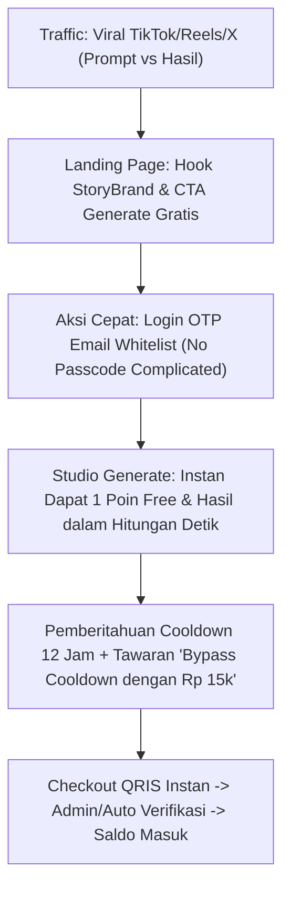

# Rencana Strategi Bisnis Real — Platform ai-gen-free

Dokumen ini memuat formulasi **Strategi Bisnis Real, Model Monetisasi, Rencana Go-To-Market (GTM), dan Unit Economics** platform `ai-gen-free` yang diadopsi dari kerangka kerja literatur di [business-strategy-references.md](./business-strategy-references.md).

---

## 1. Posisi Produk & Value Proposition (Blue Ocean & StoryBrand)

### A. Masalah Pasar Utama (Pain Points)
1. **Hambatan Akses & Pembayaran Internasional**: Mayoritas platform AI global (Midjourney, DALL-E, Sora) mewajibkan kartu kredit berdenominasi USD (Rp 150k - Rp 500k/bulan).
2. **Kompleksitas UI / Prompting**: Pengguna awam, kreator, dan UMKM di Indonesia sering kesulitan meracik *prompt engineer* teknis dalam bahasa Inggris.
3. **Kekhawatiran Privasi & Eksploitasi Data**: Banyak platform gratisan menjadikan prompt dan gambar pengguna sebagai display publik tanpa izin.

### B. Solusi & Value Proposition `ai-gen-free`
* **Pemandu Sederhana (The Guide)**: Platform lokal berbahasa Indonesia ramah pengguna yang memungkinkan siapa pun menghasilkan visual berkualitas tinggi hanya dalam 3 langkah (Masuk $\rightarrow$ Tulis Prompt $\rightarrow$ Unduh).
* **Freemium Berkeadilan (Fair Freemium)**: Memberikan kesempatan generasi gratis berulang dengan mekanisme *cooldown* yang adil (contoh: 1x generate gratis per 12 jam).
* **Akses Pembayaran Mikro Lokal (QRIS)**: Top-up kredit instan mulai dari pecahan mikro (misal Rp 10.000 / Rp 25.000) via QRIS tanpa langganan mengikat.
* **Privasi Bersih (Private by Default)**: Galeri tersimpan privat dengan retensi TTL 14 hari, tidak dipublikasikan ke publik tanpa izin.

---

## 2. Target Segmen Pasar (Ideal Customer Profiles)

| Segmen | Profil & Kebutuhan | Motivasi Konversi / Top-Up |
|---|---|---|
| **1. UMKM & Penjual Online** | Butuh foto produk estetik, banner promo sosmed, mockup visual jualan. | Hemat jutaan rupiah dibanding sewa desainer/fotografer studio. |
| **2. Content Creator & Affiliate Marketer** | Butuh ilustrasi thumbnail YouTube/TikTok, materi konten storytelling/carousel. | Kecepatan produksi konten harian tanpa kena batasan kuota platform global. |
| **3. Mahasiswa & Pekerja Kreatif** | Butuh visualisasi ide cepat untuk presentasi, tugas kuliah, atau konsep desain awal. | Pembayaran terjangkau via QRIS / e-wallet pecahan kecil. |

---

## 3. Model Monetisasi & Strategi Penetapan Harga (Pricing Psychology)

Mengacu pada prinsip **Decoy Effect (Dan Ariely)** dan **Godfather Offer (Sabri Suby)**:

```
[ Free Tier ]            [ Starter Pack (Decoy) ]     [ Creator Pro (Best Value) ]     [ Power Studio ]
Rp 0                     Rp 15.000                    Rp 49.000                        Rp 99.000
- 1 Generasi / 12 Jam    - 15 Poin (Rp 1.000/gen)     - 75 Poin (Rp 653/gen)           - 200 Poin (Rp 495/gen)
- Kecepatan Standard     - Tanpa Cooldown             - Tanpa Cooldown + Prioritas     - Tanpa Cooldown + Prioritas Maks
- TTL Storage 14 Hari    - TTL Storage 14 Hari        - Bonus 10 Prompt Template       - Bonus 25 Prompt Template + Support
```

### Mekanisme Keuangan & Unit Economics:
* **Cost per Generation (COGS)**: Estimasi biaya provider generatif (misal Siray/GPU) $\approx$ Rp 150 – Rp 300 per gambar.
* **Biaya Storage & Bandwidth**: Menggunakan Cloudflare R2 (zero egress fee) dengan TTL 14 hari auto-purge $\approx$ < Rp 10 per user/bulan.
* **Gross Profit Margin**: **> 55% - 70%** pada paket berbayar.
* **Risk Shield**: Mutasi kredit dengan pola *Hold $\rightarrow$ Capture/Release*. Jika job gagal, poin kembali utuh 100%, menjaga kepuasan (*Shep Hyken Cult of Customer*).

---

## 4. Strategi Akuisisi, Funnel & Copywriting (Direct Response)

### A. Tahapan Funnel (Russell Brunson & Sabri Suby Framework)



### B. Script & Copywriting Formula (Jim Edwards & Dan Kennedy)
* **Headline Landing Page**:  
  *"Buat Visual & Gambar Berkualitas Studio dalam 5 Detik — Tanpa Kartu Kredit, Coba Sekarang Gratis!"*
* **Sub-headline**:  
  *"Tinggalkan biaya desainer yang mahal. Cukup ketik dalam bahasa Indonesia dan wujudkan ide visual jualan atau konten sosmed Anda seketika."*
* **CTA Utama**:  
  `[ 🚀 Generate Gambar Pertama Saya — Gratis ]`

---

## 5. Strategi Retensi & Keunggulan Kompetitif Jangka Panjang (Moat)

1. **Prompt Library Lokal & Preset Generator**:  
   Menyediakan kurasi preset populer (contoh: *Foto Produk Studio Estetik*, *Anime 3D*, *Ilustrasi Buku Anak*) sehingga pengguna pemula tidak perlu bingung menyusun prompt.
2. **Penyimpanan Aset Terpusat (`/app/library`)**:  
   Memudahkan user mengunduh ulang dan menata materi konten yang sudah dibuat selama 14 hari.
3. **Multi-Provider Adapter Agility (ADR 0005 & 0012)**:  
   Kemampuan platform beralih provider API generasi (Siray, Stable Diffusion, Flux, Midjourney API, dll.) secara transparan di backend tanpa mengubah antarmuka user ataupun mengganggu ledger poin. Hal ini menjamin operasional selalu mendapatkan harga termurah dengan performa terbaik.

---

## 6. Rencana Eksekusi Go-To-Market (GTM) per Milestone

* **Milestone M1 - M3**: Validasi infrastruktur, kecepatan respon OTP, keamanan dompet saldo poin, dan keandalan sistem antrian job & mutex.
* **Milestone M4 (Peluncuran Beta Tertutup)**: Mengundang 100 kreator & penjual online pertama untuk menguji hasil gambar nyata via Siray t2i. Mengumpulkan feedback prompt dan mengukur rasio keberhasilan generate.
* **Milestone M5 & Public Launch**:
  - Kampanye peluncuran publik di media sosial dengan tagar `#BuatVisualInstan`.
  - Peluncuran paket promo *First Top-Up Bonus*.
  - Pemantauan rasio retensi D1, D7, dan D30.
